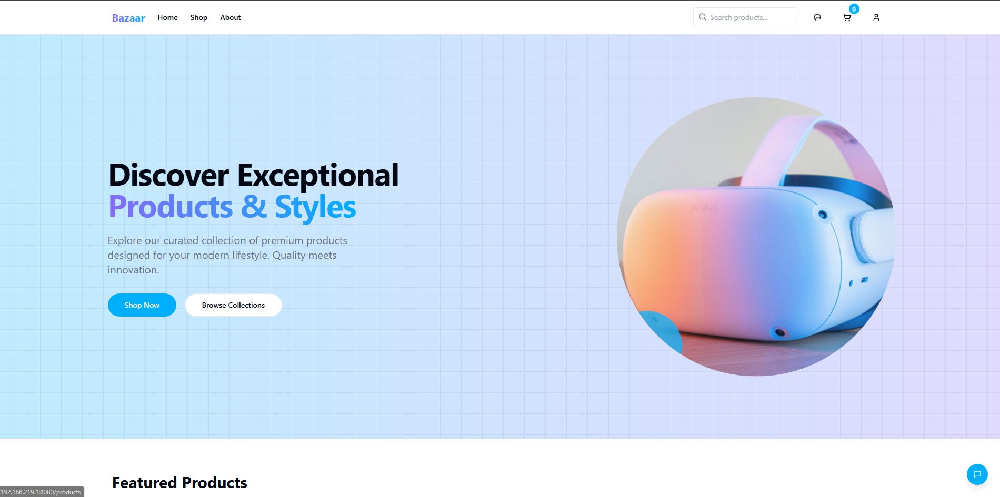

# 🌐 BAZAAR | Next-Gen E-Commerce Platform

<div align="center">
  
  <h3>Where Shopping Meets Innovation</h3>
</div>

## 🚀 Vision

**Bazaar** is redefining the e-commerce experience for the modern digital age. Our platform combines cutting-edge technology with intuitive design to create a seamless shopping journey.

## ✨ Core Features

- **AI-Powered Recommendations** - Personalized suggestions based on browsing patterns
- **Immersive Product Exploration** - Interactive 3D models and AR product visualization
- **Seamless Checkout Process** - Frictionless payments with multiple options
- **Real-time Inventory Management** - Always accurate product availability
- **Responsive Design** - Perfect experience on any device
- **Multi-Payment Support** - Integrated Stripe, PayPal, and Apple Pay
- **Smart Shopping Cart** - Persistent cart with local storage
- **User Authentication** - Secure login with Firebase and JWT
- **Interactive Product Filtering** - Dynamic category and price filters
- **Favorites System** - Save and manage favorite products

## 🛠️ Tech Stack

```
Frontend: React + TypeScript + Vite | Tailwind CSS + Shadcn UI | Framer Motion
Backend: Node.js + Express | MongoDB | JWT Authentication | Firebase Admin SDK
Payments: Stripe API | PayPal SDK | Apple Pay integration
State Management: Context API | Local Storage for persistence
```

## 🔍 Quick Start

```bash
# Clone the repository
git clone https://github.com/naveed-gung/bazaar.git

# Install dependencies for both frontend and backend
cd bazaar
npm run setup

# Start development servers
npm run dev
```

## 📱 App Preview

| Home Page | Product Details | Shopping Cart |
|-----------|-----------------|---------------|
| Modern UI with trending items | Interactive product view | Smart checkout process |

## 🔧 Environment Setup

Both frontend and backend include environment templates. Copy and configure them for your setup:

```
cp frontend/.env.example frontend/.env
cp backend/.env.example backend/.env
```

### Required Environment Variables

#### Frontend
- `VITE_API_URL` - Backend API URL
- `VITE_FIREBASE_CONFIG` - Firebase credentials for authentication

#### Backend
- `MONGODB_URI` - MongoDB connection string
- `JWT_SECRET` - Secret key for JWT authentication
- `STRIPE_SECRET_KEY` - Stripe payment processing API key
- `PAYPAL_CLIENT_ID` - PayPal client ID
- `PAYPAL_CLIENT_SECRET` - PayPal client secret
- `FIREBASE_PROJECT_ID` - Firebase project ID for admin SDK
- `FIREBASE_CLIENT_EMAIL` - Firebase service account email
- `FIREBASE_PRIVATE_KEY` - Firebase private key

## 💳 Payment Processing

### Stripe Integration
The platform uses Stripe for credit card processing with a custom checkout form that supports:
- Credit/Debit cards
- Apple Pay
- Dark mode compatible UI
- Secure token-based transactions

### PayPal Integration
Alternative payment option with:
- Express checkout
- PayPal account payments
- Credit card processing through PayPal

## 🔐 Authentication System

- Firebase Authentication for frontend
- JWT-based session management
- Role-based access control
- Secure API routes with middleware

## 🌟 Future Roadmap

- Voice-assisted shopping experience
- Blockchain-based payment system
- Customer loyalty NFT program
- Global CDN for faster content delivery
- AR/VR shopping environment
- Subscription-based product offerings
- AI chatbot for customer service

## 📦 Project Structure

```
/frontend            - React frontend application
  /src
    /components      - Reusable UI components
    /contexts        - Context API providers
    /hooks           - Custom React hooks
    /pages           - Page components
    /lib             - Utility functions

/backend             - Node.js Express API
  /src
    /controllers     - Request handlers
    /models          - MongoDB schemas
    /routes          - API endpoints
    /middleware      - Express middleware
    /services        - Business logic
```

---

<div align="center">
  <strong>BAZAAR</strong> - Shopping Reimagined for the Digital Future
</div> 
