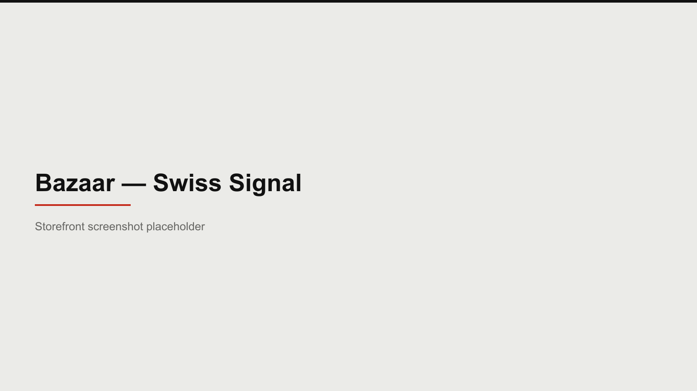
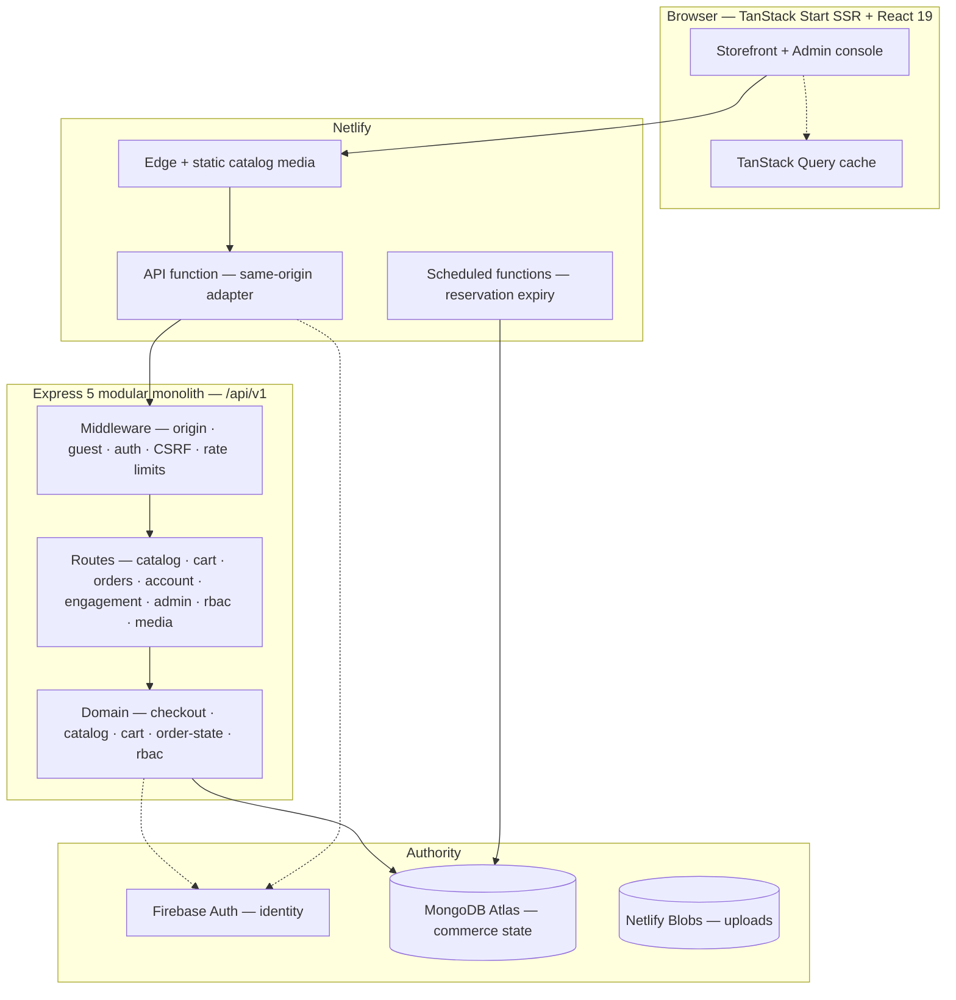
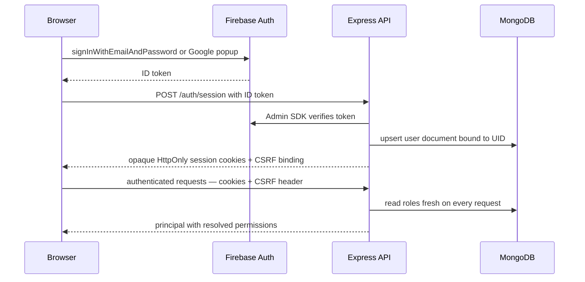
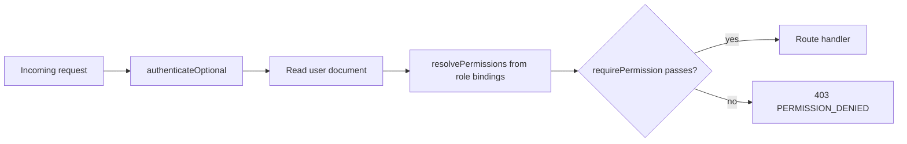
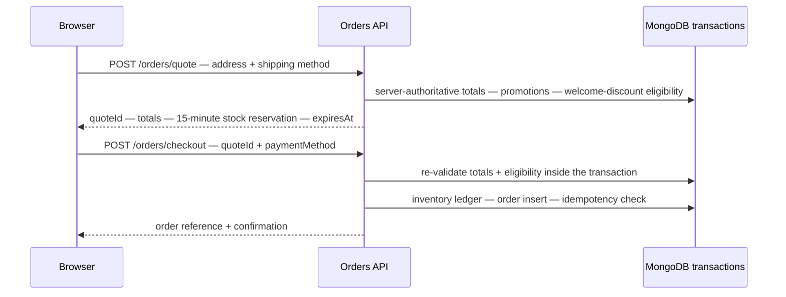

<p align="center">
  
</p>

<p align="center">
  Full-stack electronics commerce with guest-first shopping, Firebase authentication,<br />
  role-based access control, and server-authoritative money and inventory.
</p>

<p align="center">
  <a href="https://bazaa1.netlify.app/"><strong>Live storefront</strong></a>
  ·
  <a href="https://github.com/naveed-gung/bazaar"><strong>Source</strong></a>
</p>

<p align="center">
  
  
  
  
  
  
</p>



<h2> What makes Bazaar different</h2>

- Guest-first cart, favorites, comparisons and checkout; state merges into the account on sign-in.
- Local-first guest cart: instant add/quantity/remove with zero network calls, merged into MongoDB on sign-in.
- Role-based access control end to end: a shared permission contract, four seeded system roles
  (`owner`, `ops`, `support`, `customer`), per-endpoint `requirePermission(...)` guards on every
  admin/media route, a role and user-role management API with lockout prevention, and per-request
  permission resolution so role edits take effect on the caller's next request.
- Secure Firebase-to-Bazaar session exchange with rotation, CSRF binding and replay revocation.
- MongoDB-backed catalog with variants, inventory ledger, reservations, promotions and orders.
- Transactional checkout, idempotency protection, exact reservation/cart verification and a
  server-validated first-order welcome discount.
- Light cool-white interface plus neutral-charcoal dark mode — no gradients.
- Customer account, address, session, returns, tracking, notification and comparison pages.
- Admin catalog, inventory, fulfillment, returns, review moderation, audit log and analytics surfaces.

<h2> Architecture</h2>

### System overview


```mermaid
flowchart TB
    subgraph client["Browser — TanStack Start SSR + React 19"]
        UI["Storefront + Admin console"]
        Q["TanStack Query cache"]
    end
    subgraph edge["Netlify"]
        CDN["Edge + static catalog media"]
        FN["API function — same-origin adapter"]
        SCH["Scheduled functions — reservation expiry"]
    end
    subgraph api["Express 5 modular monolith — /api/v1"]
        MW["Middleware — origin · guest · auth · CSRF · rate limits"]
        RT["Routes — catalog · cart · orders · account · engagement · admin · rbac · media"]
        DOM["Domain — checkout · catalog · cart · order-state · rbac"]
    end
    subgraph data["Authority"]
        FA["Firebase Auth — identity"]
        MDB[("MongoDB Atlas — commerce state")]
        NB[("Netlify Blobs — uploads")]
    end
    UI --> CDN
    CDN --> FN
    FN --> MW --> RT --> DOM
    DOM --> MDB
    DOM -.-> FA
    FN -.-> FA
    SCH --> MDB
    UI -.-> Q
```

| Workspace           | Responsibility                                                            |
| ------------------- | ------------------------------------------------------------------------- |
| `frontend`          | TanStack Start, React 19, Tailwind CSS 4, TanStack Query                  |
| `backend`           | TypeScript, Express 5, MongoDB transactions, Firebase Admin               |
| `packages/shared`   | Shared DTOs, identifiers, money, order states and the permission contract |
| `netlify/functions` | API adapter and scheduled reservation processing                          |

### Authentication flow


```mermaid
sequenceDiagram
    participant B as Browser
    participant F as Firebase Auth
    participant E as Express API
    participant M as MongoDB
    B->>F: signInWithEmailAndPassword or Google popup
    F-->>B: ID token
    B->>E: POST /auth/session with ID token
    E->>F: Admin SDK verifies token
    E->>M: upsert user document bound to UID
    E-->>B: opaque HttpOnly session cookies + CSRF binding
    B->>E: authenticated requests — cookies + CSRF header
    E->>M: read roles fresh on every request
    E-->>B: principal with resolved permissions
```

### Role-based access control


```mermaid
flowchart LR
    REQ["Incoming request"] --> AUTH["authenticateOptional"]
    AUTH --> READ["Read user document"]
    READ --> RES["resolvePermissions from role bindings"]
    RES --> GUARD{"requirePermission passes?"}
    GUARD -- yes --> ROUTE["Route handler"]
    GUARD -- no --> DENY["403 PERMISSION_DENIED"]
```

### Transactional checkout


```mermaid
sequenceDiagram
    participant B as Browser
    participant E as Orders API
    participant M as MongoDB transactions
    B->>E: POST /orders/quote — address + shipping method
    E->>M: server-authoritative totals — promotions — welcome-discount eligibility
    E-->>B: quoteId — totals — 15-minute stock reservation — expiresAt
    B->>E: POST /orders/checkout — quoteId + paymentMethod
    E->>M: re-validate totals + eligibility inside the transaction
    E->>M: inventory ledger — order insert — idempotency check
    E-->>B: order reference + confirmation
```

<h2> Runtime requirements</h2>

- Node.js 24 or newer and npm 11 or newer.
- MongoDB Atlas deployment supporting replica-set transactions.
- Firebase project with a registered web application and Admin SDK service account.
- Netlify account and CLI for production functions and scheduled jobs.

<h2> Local development</h2>

```bash
git clone https://github.com/naveed-gung/bazaar.git
cd bazaar
npm install
npm run db:bootstrap   # collections, indexes, transaction smoke test
npm run db:seed        # catalogue, history, system roles and demo accounts
npm run dev            # frontend + API in parallel
```

Local endpoints:

- Storefront: `http://127.0.0.1:8080`
- API: `http://127.0.0.1:8787/api/v1`
- Health: `http://127.0.0.1:8787/api/v1/health`

### Environment variables

Store real values only in ignored local environment files (`atlas-credentials.env`,
`.env.local`) or provider secret storage. [`config.example.txt`](config.example.txt) lists every
name with placeholders — never commit real values. The names the backend reads:

| Name                                                                                                                                | Purpose                      |
| ------------------------------------------------------------------- | ---------------------------- |
| `NODE_ENV`, `PORT`                                                  | Server mode and port         |
| `MONGODB_URI`, `MONGODB_DB_NAME`, `MONGODB_DNS_SERVERS`             | Atlas connection             |
| `WEB_ORIGIN`                                                        | Allowed browser origin       |
| `FIREBASE_PROJECT_ID`, `FIREBASE_ADMIN_CREDENTIALS`, `FIREBASE_CLIENT_EMAIL`, `FIREBASE_PRIVATE_KEY`, `FIREBASE_PRIVATE_KEY_BASE64` | Firebase Admin               |
| `BOOTSTRAP_ADMIN_EMAIL`, `BOOTSTRAP_ADMIN_UID`, `BOOTSTRAP_CLIENT_EMAIL`, `BOOTSTRAP_CLIENT_UID` | Bootstrap account identities |
| `PEXELS_API_KEY`                                                    | Catalog/hero photography     |
| `RESEND_API_KEY`                                                    | Optional transactional email |
| `VITE_FIREBASE_API_KEY`, `VITE_FIREBASE_AUTH_DOMAIN`, `VITE_FIREBASE_PROJECT_ID`, `VITE_FIREBASE_APP_ID` | Firebase browser SDK         |

### Seeded accounts

`npm run db:seed` upserts these users idempotently. The five `@bazaar.dev` logins are created as
real Firebase Auth users **and** Mongo documents carrying the role assignment, so they sign in
through the normal login form. Their password is a development seed value only:

| Email                            | Password (DEV ONLY) | Role       | Kind                              |
| -------------------------------- | ------------------- | ---------- | --------------------------------- |
| `owner@bazaar.dev`               | `Bazaar#Dev2026`    | `owner`    | Full administrative access        |
| `ops@bazaar.dev`                 | `Bazaar#Dev2026`    | `ops`      | Operations staff                  |
| `support@bazaar.dev`             | `Bazaar#Dev2026`    | `support`  | Support staff                     |
| `customer@bazaar.dev`            | `Bazaar#Dev2026`    | `customer` | Shopper                           |
| `customer2@bazaar.dev`           | `Bazaar#Dev2026`    | `customer` | Shopper                           |
| `$BOOTSTRAP_ADMIN_EMAIL`         | your env identity   | `owner`    | Real identity from your env file  |
| `$BOOTSTRAP_CLIENT_EMAIL`        | your env identity   | `customer` | Real identity from your env file  |
| `seed-staff-ops@example.com`     | —                   | `ops`      | Demo staff row                    |
| `seed-staff-support@example.com` | —                   | `support`  | Demo staff row                    |
| `seed-shopper-ava@example.com`   | —                   | `customer` | Demo shopper (order history)      |
| `seed-shopper-noah@example.com`  | —                   | `customer` | Demo shopper                      |
| `seed-shopper-lena@example.com`  | —                   | `customer` | Demo shopper                      |

Requirements for the `@bazaar.dev` logins to work: the Email/Password sign-in provider must be
enabled in the Firebase console, and the frontend `VITE_FIREBASE_PROJECT_ID` must match the
Admin SDK credentials' project. These are development credentials for your own Firebase project —
rotate or remove them before any public deployment. To grant a role to a real signed-in user, use
the management API (`PUT /api/v1/admin/users/:uid/roles`) as an `owner`; permissions resolve from
the database on every request.

<h2> Commands</h2>

| Command                | What it does                                                                           |
| ---------------------- | -------------------------------------------------------------------------------------- |
| `npm run dev`          | Frontend + API in parallel                                                             |
| `npm run build`        | Shared, backend and frontend production builds                                         |
| `npm run typecheck`    | Strict TypeScript checks across all workspaces                                         |
| `npm run lint`         | Backend (`--max-warnings=0`) and frontend ESLint                                       |
| `npm test`             | Backend Vitest suite (unit, contract and Mongo integration)                            |
| `npm run db:bootstrap` | Collections, indexes and a transaction smoke test                                      |
| `npm run db:seed`      | 57 products, 109 variants, 13 categories, order history, 4 system roles, demo accounts |

<h2> Security model</h2>

- HttpOnly opaque guest, access and refresh cookies.
- Fifteen-minute access sessions; rotating refresh families with idle and absolute limits.
- Exact origin checks, session-bound CSRF, CSP and rate limits.
- Database-authoritative RBAC: permissions resolve from the user document read on each request,
  so revoked access applies immediately; `users:manage` cannot be stripped from `owner` or from
  yourself (409 `LOCKOUT_PREVENTED`), and system roles cannot be deleted (409 `ROLE_IS_SYSTEM`).
- Server-calculated prices, totals, promotions and inventory changes.
- Transactional idempotency for checkout and inventory adjustments.
- Same-origin catalog media with signature and canonical Base64 validation.

Never commit `.env*`, Atlas credentials, Firebase Admin JSON, private keys or provider tokens —
`.gitignore` blocks them; verify with `git ls-files` before committing.

<h2> Payment notice</h2>

The checkout flow runs through a built-in payment simulator. It never collects card numbers and
never performs a real charge.

<h2> Usage requirements</h2>

- Keep the copyright and MIT permission notice with every copy or substantial distribution.
- Store Atlas, Firebase, email-provider and deployment credentials only in local or provider secret storage.
- Treat the included catalog, accounts, orders and payment flow as demo data until production providers and policies are configured.
- Follow MongoDB Atlas, Firebase, Netlify and third-party dependency terms for hosted deployments.
- Perform your own privacy, tax, consumer-protection and security review before processing real customer data.

<h2> Deployment</h2>

Netlify serves TanStack Start SSR, static catalog media and same-origin Express functions.

HUMAN-GATE: deploying is a human decision, never an agent action. Production deployment uses:

```bash
netlify deploy --build --prod
```

Required production variables belong in Netlify environment configuration — not source control.

<h2> Licensing</h2>

**This project** — released under the [MIT License](LICENSE).

**Bundled free assets and libraries**

| Asset / library                          | License                          | Notes                                                     |
| ---------------------------------------- | -------------------------------- | --------------------------------------------------------- |
| Archivo, Instrument Sans (variable woff2) | SIL Open Font License 1.1        | Self-hosted latin subsets in `frontend/public/fonts/`     |
| Catalog and hero photography              | Pexels License (free to use)     | Per-photo credits in [`frontend/public/catalog/CREDITS.md`](frontend/public/catalog/CREDITS.md); hero photo by [Polina Tankilevitch](https://www.pexels.com/@polina-tankilevitch) via Pexels |
| React, Express, TanStack, Tailwind, lucide-react and other npm dependencies | Their respective open-source licenses (MIT / ISC predominantly) | See `package-lock.json` for the full inventory |

**External services (governed by their own terms, may incur cost)**

| Service       | Role                                | Terms govern                        |
| ------------- | ----------------------------------- | ------------------------------------ |
| MongoDB Atlas | Commerce database                   | Data storage, transfer, tier pricing |
| Firebase      | Authentication identities           | Auth quotas and project configuration |
| Netlify       | Hosting, functions, scheduled jobs  | Bandwidth, function invocations, pricing tiers |

Third-party packages and services retain their respective licenses and terms.
