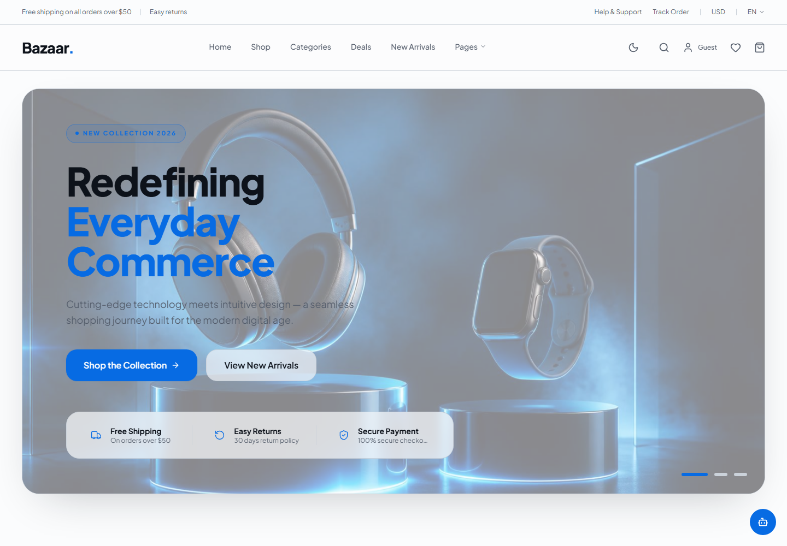

<p align="center">
  
</p>

<p align="center">
  Full-stack electronics commerce with guest-first shopping, Firebase authentication,<br />
  server-authoritative money and inventory, plus scroll-controlled product cinematics.
</p>

<p align="center">
  <a href="https://bazaa1.netlify.app/"><strong>Live storefront</strong></a>
  ·
  <a href="https://github.com/naveed-gung/bazaar"><strong>Source</strong></a>
</p>

<p align="center">
  
  
  
  
  
  
</p>



<h2> What makes Bazaar different</h2>

- Guest-first cart, favorites, comparisons, assistant, checkout and order access.
- Secure Firebase-to-Bazaar session exchange with rotation, CSRF binding and replay revocation.
- MongoDB-backed catalog, variants, inventory ledger, reservations, promotions and orders.
- Transactional checkout, idempotency protection and exact reservation/cart verification.
- Light cool-white interface plus neutral-charcoal dark mode—no gradients.
- 24 product-specific H.264 clips scrubbed by scroll position instead of autoplay.
- Data-saver and reduced-motion modes download no product video.
- Customer account, address, session, returns, tracking, notification and comparison pages.
- Admin catalog, inventory, fulfillment, returns, review moderation, audit and analytics surfaces.

<h2> Architecture</h2>

```text
Browser / TanStack Start
        │ same-origin /api/v1
        ▼
Netlify Function → Express modular monolith
        ├── Firebase Admin — identity verification
        ├── MongoDB Atlas — commerce authority
        ├── Netlify Blobs — replaceable product uploads
        └── Scheduled Functions — reservation expiry/jobs
```

| Workspace | Responsibility |
| --- | --- |
| `frontend` | TanStack Start, React 19, Tailwind CSS 4, TanStack Query |
| `backend` | TypeScript, Express 5, MongoDB transactions, Firebase Admin |
| `packages/shared` | Shared DTOs, identifiers, money and order states |
| `netlify/functions` | API adapter and scheduled reservation processing |

<h2> Runtime requirements</h2>

- Node.js 24 or newer and npm 11 or newer.
- MongoDB Atlas deployment supporting replica-set transactions.
- Firebase project with a registered web application and Admin SDK service account.
- Netlify account and CLI for production functions and scheduled jobs.

<h2> Local development</h2>

Requirements: Node.js 24+, npm, MongoDB Atlas replica-set transactions and a Firebase project.

```bash
git clone https://github.com/naveed-gung/bazaar.git
cd bazaar
npm install
npm run db:bootstrap
npm run db:seed
npm run dev
```

Store real configuration only in ignored local environment files or provider secret storage. `config.example.txt` lists required variable names without credentials.

Local endpoints:

- Storefront: `http://127.0.0.1:8080`
- API: `http://127.0.0.1:8787/api/v1`
- Health: `http://127.0.0.1:8787/api/v1/health`

<h2> Commands</h2>

```bash
npm run dev            # frontend + API
npm run typecheck      # strict TypeScript checks
npm run lint           # backend + frontend lint
npm test               # unit, contract and Mongo integration tests
npm run build          # shared + API + TanStack/Netlify production build
npm run db:bootstrap   # collections, indexes, transaction smoke test
npm run db:seed        # 24 products, 13 categories, two bootstrap accounts
```

<h2> Security model</h2>

- HttpOnly opaque guest, access and refresh cookies.
- Fifteen-minute access sessions; rotating refresh families with idle and absolute limits.
- Exact origin checks, session-bound CSRF, CSP, rate limits and DB-authoritative roles.
- Server-calculated prices, totals, promotions and inventory changes.
- Transactional idempotency for checkout and inventory adjustments.
- Same-origin catalog media with signature and canonical Base64 validation.

Never commit `.env*`, Atlas credentials, Firebase Admin JSON, private keys or provider tokens.

<h2> Payment notice</h2>

Bazaar currently uses a clearly labeled payment simulator. It never collects card numbers and never performs a real charge.

<h2> Usage requirements</h2>

- Keep the copyright and MIT permission notice with every copy or substantial distribution.
- Store Atlas, Firebase, email-provider and deployment credentials only in local or provider secret storage.
- Treat the included catalog, accounts, orders and payment flow as demo data and simulation until production providers and policies are configured.
- Follow MongoDB Atlas, Firebase, Netlify and third-party dependency terms for hosted deployments.
- Perform your own privacy, tax, consumer-protection and security review before processing real customer data.

<h2> Deployment</h2>

Netlify serves TanStack Start SSR, static catalog media and same-origin Express functions. Production deployment uses:

```bash
netlify deploy --build --prod
```

Required production variables belong in Netlify environment configuration—not source control.

<h2> License</h2>

Released under the [MIT License](LICENSE). Third-party packages and services retain their respective licenses and terms.
